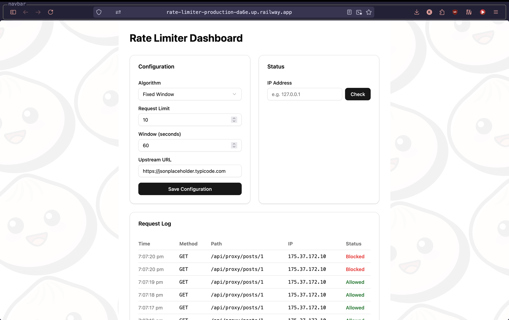
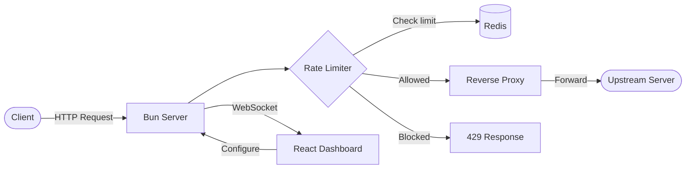

# Rate Limiter Proxy

A rate-limiting reverse proxy with a real-time dashboard. Requests are proxied to a configurable upstream server and rate-limited per IP using one of three algorithms all backed by Redis.

**[Live Demo](https://rate-limiter-production-da6e.up.railway.app/)**



## Architecture



## Features

- **3 rate limiting algorithms** — Fixed Window, Sliding Window, and Token Bucket
- **Reverse proxy** — forwards allowed requests to a configurable upstream URL
- **Real-time dashboard** — configure algorithms, check per-IP status, and watch requests stream in via WebSocket
- **Per-IP tracking** — rate limits are applied independently per client IP
- **Rate limit headers** — responses include `X-RateLimit-Limit`, `X-RateLimit-Remaining`, and `X-RateLimit-Reset`

## Tech Stack

- **Runtime:** [Bun](https://bun.sh)
- **Server:** [Hono](https://hono.dev)
- **Frontend:** React, Tailwind CSS, shadcn/ui
- **Data Store:** Redis ([ioredis](https://github.com/redis/ioredis))
- **Validation:** Zod
- **Load Testing:** [k6](https://k6.io) (Grafana)
- **CI:** GitHub Actions (type checking, linting, tests)
- **CD:** Railway with Docker

## Rate Limiting Algorithms

| Algorithm          | How it works                                                                                       | Trade-off                                                       |
| ------------------ | -------------------------------------------------------------------------------------------------- | --------------------------------------------------------------- |
| **Fixed Window**   | Divides time into blocks (e.g., 0:00–1:00) and counts requests per block with `INCR` + `EXPIRE`    | Simple however two bursts can slip through at a window boundary |
| **Sliding Window** | Tracks individual request timestamps in a sorted set, such that the window moves with each request | Smoother limiting, costs a few more Redis calls                 |
| **Token Bucket**   | A bucket holds tokens that refill at a steady rate, each request consumes one token                | Handles bursts gracefully while keeping a steady average        |

## API

| Method | Endpoint                 | Description                                      |
| ------ | ------------------------ | ------------------------------------------------ |
| `GET`  | `/api/config`            | Get current rate limiter configuration           |
| `PUT`  | `/api/config`            | Update algorithm, limit, window, or upstream URL |
| `GET`  | `/api/config/status/:ip` | Check rate limit status for a specific IP        |
| `GET`  | `/api/logs`              | Get recent request log entries                   |
| `ALL`  | `/api/proxy/*`           | Rate-limited reverse proxy to upstream           |
| `WS`   | `/ws`                    | WebSocket for live request log updates           |

## Getting Started

### Prerequisites

- [Bun](https://bun.sh) (v1.3+)
- [Redis](https://redis.io) running on `localhost:6379`

### Run Locally

```bash
bun install
bun dev
```

Open [http://localhost:3000](http://localhost:3000).

### Run Tests

```bash
bun test
```

### Load Testing

Requires [k6](https://grafana.com/docs/k6/latest/set-up/install-k6/) to be installed.

```bash
bun run loadtest:smoke
bun run loadtest
bun run loadtest:stress
bun run loadtest:compare
```

### Lint & Type Check

```bash
bun run lint
bunx tsc --noEmit
```

## Project Structure

```
src/
├── algorithms/          # Rate limiting implementations
│   ├── fixedWindow.ts
│   ├── slidingWindow.ts
│   └── tokenBucket.ts
├── components/          # React dashboard components
│   ├── ConfigPanel.tsx
│   ├── StatusPanel.tsx
│   └── RequestLogPanel.tsx
├── lib/
│   ├── redis.ts         # Redis client (supports REDIS_URL env var)
│   └── ws.ts            # WebSocket client tracking
├── middleware/
│   └── rateLimiter.ts   # Hono middleware that applies rate limiting
├── routes/
│   ├── config.ts        # Configuration API
│   ├── logs.ts          # Request log API
│   └── proxy.ts         # Reverse proxy
├── schemas/
│   └── config.ts        # Zod validation schema
├── config.ts            # Runtime configuration state
├── types.ts             # Shared TypeScript types
└── index.ts             # Server entry point

loadtest/
├── smoke.js             # Sanity check
├── load.js              # Ramp to 500 concurrent VUs
├── stress.js            # Push to 1000 req/s arrival rate
└── compare-algorithms.sh # Run load test across all 3 algorithms
```

## Deployment

The app is deployed on [Railway](https://railway.com) using Docker.

- **CI:** GitHub Actions runs type checking, linting, and tests on every push
- **CD:** Railway auto-deploys from `main` after CI passes (Wait for CI enabled)
- **Redis:** Railway Redis add-on, connected via `REDIS_URL` environment variable

